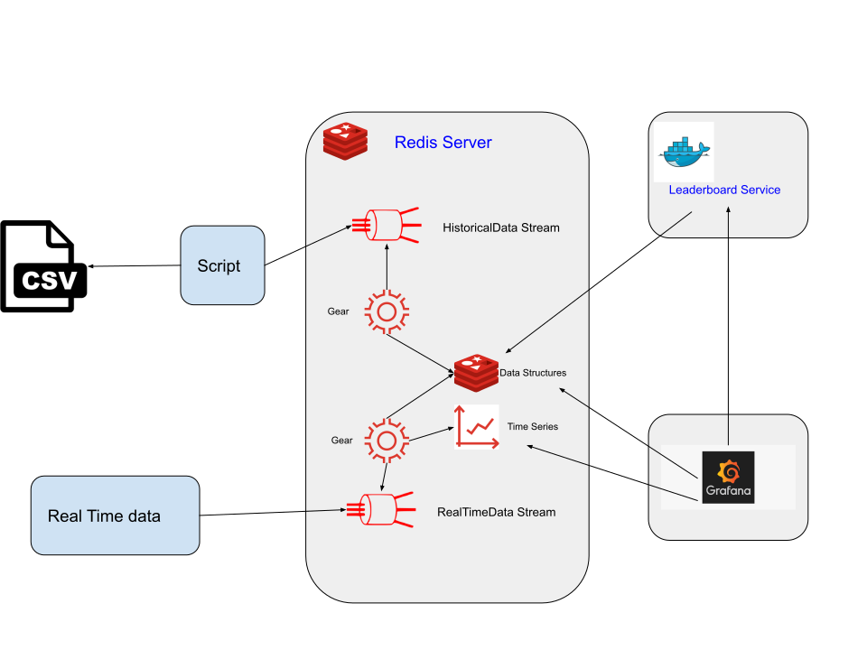
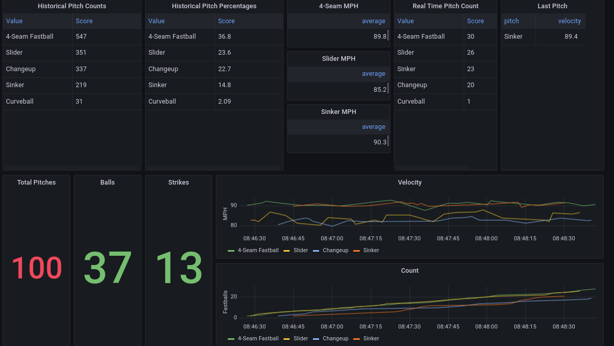

## Example of processing statcast data in real time using Redis Gears and Redis Time Series.

### Architecture




### Screenshot




### Setup

### Prerequisites 
- [Docker](https://www.docker.com/products/docker-desktop)
- [Docker Compose](https://docs.docker.com/compose/install/)
- [Terraform](https://www.terraform.io/downloads.html)


#### Start the containers

```
docker-compose up
```

#### Use terraform to setup the grafana instance

```
cd terraform && terraform init && terraform apply
```

#### Setup a virtual environment in python

```
python3 -m venv .venv
source .venv/bin/activate
pip install -r requirements.txt
```

### Grab some data

Note the Grafana dashboards are hard coded now for Johnny Cueto pitching because a Giants fan got to decide.

```
>>> from pybaseball import statcast_pitcher
>>> from pybaseball import playerid_lookup
>>> playerid_lookup('cueto', 'johnny')
>>> ytd=statcast_pitcher('2021-04-01', '2021-08-02', 456501)
>>> today=statcast_pitcher('2021-08-03', '2021-08-03', 456501)
>>> today.to_csv('cueto_0803.csv')
>>> ytd.to_csv('cueto_ytd.csv')
```


### Load the historical data

```
redis-cli flushdb && ./load_gears.sh && ./stream_data.py cueto_ytd.csv HistoricalPitches
```

### Run the real-time data

```
./stream_data.py cueto_0803.csv RealTimePitches 1500
```

### View the dashboard in real time

[Dashboard Link](http://localhost:3000/d/OYw4XXtnk/pitches?orgId=1&from=now-15m&to=now&refresh=1s)

The login is admin/admin